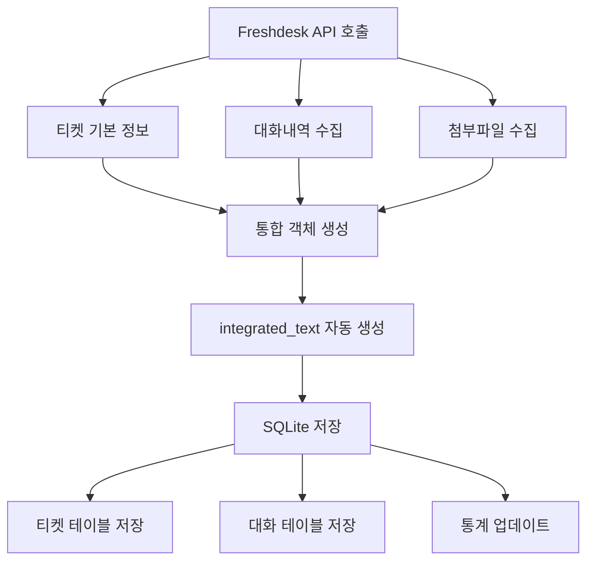

# 🗂️ 통합 객체 저장 패턴 지침서

## 📋 개요

이 문서는 Freshdesk API에서 수집한 티켓/대화/첨부파일 정보를 하나의 **통합 객체**로 구성하여 저장하는 패턴에 대한 공식 지침서입니다.

## 🎯 목표

- ✅ 티켓, 대화내역, 첨부파일을 하나의 통합 객체로 구성
- ✅ 요약 생성 및 임베딩에 최적화된 데이터 구조 제공
- ✅ SQLite에 통합 객체를 저장하여 데이터 무결성 보장
- ✅ 일관된 데이터 처리 패턴으로 유지보수성 향상

## 🏗️ 통합 객체 구조

### 📧 티켓 통합 객체 (`integrated_ticket`)

```json
{
  "id": 12345,
  "subject": "로그인 문제",
  "description": "사용자가 로그인할 수 없습니다",
  "description_text": "사용자가 로그인할 수 없습니다",
  "status": "open",
  "priority": 2,
  "conversations": [
    {
      "id": 67890,
      "body": "추가 정보 요청",
      "body_text": "추가 정보 요청",
      "incoming": true,
      "user_id": 123,
      "created_at": "2024-01-01T00:00:00Z"
    }
  ],
  "all_attachments": [
    {
      "id": 111,
      "name": "screenshot.png",
      "content_type": "image/png",
      "size": 1024,
      "ticket_id": 12345,
      "conversation_id": 67890
    }
  ],
  "has_conversations": true,
  "has_attachments": true,
  "conversation_count": 1,
  "attachment_count": 1,
  "integration_timestamp": "2024-01-01T12:00:00Z",
  "object_type": "integrated_ticket",
  "integrated_text": "제목: 로그인 문제\n\n설명: 사용자가 로그인할 수 없습니다\n\n대화: 추가 정보 요청\n\n첨부파일: screenshot.png"
}
```

### 📚 지식베이스 통합 객체 (`integrated_article`)

```json
{
  "id": 789,
  "title": "로그인 트러블슈팅 가이드",
  "description": "로그인 문제 해결 방법",
  "status": "published",
  "category_id": 10,
  "folder_id": 5,
  "attachments": [
    {
      "id": 222,
      "name": "guide.pdf",
      "content_type": "application/pdf",
      "size": 2048
    }
  ],
  "has_attachments": true,
  "attachment_count": 1,
  "integration_timestamp": "2024-01-01T12:00:00Z",
  "object_type": "integrated_article",
  "integrated_text": "제목: 로그인 트러블슈팅 가이드\n\n설명: 로그인 문제 해결 방법\n\n첨부파일: guide.pdf"
}
```

## 🔧 핵심 함수

### 1. 통합 객체 생성

#### `create_integrated_ticket_object()`

```python
def create_integrated_ticket_object(
    ticket: Dict[str, Any], 
    conversations: Optional[List[Dict[str, Any]]] = None, 
    attachments: Optional[List[Dict[str, Any]]] = None
) -> Dict[str, Any]:
    """
    티켓, 대화내역, 첨부파일을 하나의 통합 객체로 생성합니다.
    """
```

**주요 기능:**
- 기본 티켓 정보 + 대화내역 + 첨부파일 통합
- `integrated_text` 필드 자동 생성 (요약/임베딩용)
- 메타정보 자동 추가 (`has_conversations`, `conversation_count` 등)

#### `create_integrated_article_object()`

```python
def create_integrated_article_object(
    article: Dict[str, Any], 
    attachments: Optional[List[Dict[str, Any]]] = None
) -> Dict[str, Any]:
    """
    지식베이스 문서와 첨부파일을 하나의 통합 객체로 생성합니다.
    """
```

### 2. 통합 객체 저장

#### `store_integrated_object_to_sqlite()`

```python
def store_integrated_object_to_sqlite(
    db: SQLiteDatabase, 
    integrated_object: Dict[str, Any], 
    company_id: str, 
    platform: str = "freshdesk"
) -> bool:
    """
    통합 객체를 SQLite 데이터베이스에 저장합니다.
    """
```

**저장 패턴:**
1. `object_type` 확인 (`integrated_ticket` 또는 `integrated_article`)
2. 통합 객체 전체를 `raw_data` 필드에 JSON으로 저장
3. 대화내역은 별도 테이블에도 개별 저장 (검색 최적화)
4. `company_id`와 `platform` 자동 추가

## 📊 데이터 처리 플로우



## 🎯 사용 예시

### 데이터 수집 및 저장

```python
from backend.api.ingest import (
    create_integrated_ticket_object,
    store_integrated_object_to_sqlite
)
from backend.core.database import SQLiteDatabase

# 1. 데이터베이스 연결
db = SQLiteDatabase("freshdesk_test_data.db")
db.connect()
db.create_tables()

# 2. Freshdesk에서 수집한 데이터 (예시)
ticket = {
    "id": 12345,
    "subject": "로그인 문제",
    "description": "사용자가 로그인할 수 없습니다"
}

conversations = [
    {
        "id": 67890,
        "body_text": "추가 정보를 제공해 주세요",
        "incoming": True,
        "created_at": "2024-01-01T00:00:00Z"
    }
]

attachments = [
    {
        "id": 111,
        "name": "error_log.txt",
        "content_type": "text/plain",
        "size": 512
    }
]

# 3. 통합 객체 생성
integrated_ticket = create_integrated_ticket_object(
    ticket=ticket,
    conversations=conversations,
    attachments=attachments
)

# 4. SQLite에 저장
success = store_integrated_object_to_sqlite(
    db=db,
    integrated_object=integrated_ticket,
    company_id="wedosoft",
    platform="freshdesk"
)

if success:
    print("통합 객체 저장 완료!")
```

### 통합 객체 조회

```python
# SQLite에서 통합 객체 조회
from backend.api.ingest import get_integrated_object_from_sqlite

integrated_obj = get_integrated_object_from_sqlite(
    db=db,
    doc_type="ticket",
    object_id="12345",
    company_id="wedosoft"
)

if integrated_obj:
    print(f"제목: {integrated_obj['subject']}")
    print(f"대화 수: {integrated_obj['conversation_count']}")
    print(f"첨부파일 수: {integrated_obj['attachment_count']}")
```

## ⚡ 성능 최적화

### 배치 처리

```python
# 대량의 티켓을 배치로 처리
tickets_saved = 0
for ticket in tickets:
    try:
        integrated_ticket = create_integrated_ticket_object(
            ticket=ticket,
            conversations=ticket.get("conversations", []),
            attachments=ticket.get("all_attachments", [])
        )
        
        success = store_integrated_object_to_sqlite(
            db=db,
            integrated_object=integrated_ticket,
            company_id=company_id,
            platform='freshdesk'
        )
        
        if success:
            tickets_saved += 1
            if tickets_saved % 10 == 0:
                logger.info(f"진행상황: {tickets_saved}/{len(tickets)}")
                
    except Exception as e:
        logger.error(f"저장 실패 (ID: {ticket.get('id')}): {e}")
```

## 🔍 검색 및 활용

### 요약 생성용 텍스트 추출

```python
from backend.api.ingest import extract_integrated_text_for_summary

summary_text = extract_integrated_text_for_summary(
    integrated_object=integrated_ticket,
    max_length=5000
)

# LLM에 전달하여 요약 생성
summary = await llm_manager.generate_ticket_summary(summary_text)
```

### 임베딩용 텍스트 추출

```python
from backend.api.ingest import extract_integrated_text_for_embedding

embedding_text = extract_integrated_text_for_embedding(
    integrated_object=integrated_ticket
)

# 임베딩 생성
embedding = embed_documents([embedding_text])[0]
```

## 📈 모니터링 및 통계

### 수집 통계 확인

```python
# 저장된 통합 객체 통계
stats = db.get_collection_stats(company_id="wedosoft")

print(f"티켓: {stats['tickets']}개")
print(f"대화: {stats['conversations']}개") 
print(f"문서: {stats['articles']}개")
print(f"첨부파일: {stats['attachments']}개")
```

### 수집 작업 로깅

```python
# 수집 작업 시작 로그
job_start_data = {
    'job_id': f"ingest_{int(time.time())}",
    'company_id': company_id,
    'job_type': 'ingest',
    'status': 'started',
    'start_time': datetime.now().isoformat(),
    'config': {
        'tickets_count': len(tickets),
        'articles_count': len(articles)
    }
}
db.log_collection_job(job_start_data)
```

## ⚠️ 주의사항

### 1. 데이터 무결성
- 모든 통합 객체는 `object_type` 필드를 반드시 포함해야 함
- `company_id`와 `platform` 정보는 자동으로 추가됨
- `integrated_text` 필드는 자동 생성되므로 수동 수정 금지

### 2. 메모리 사용량
- 대량의 대화내역이 있는 경우 메모리 사용량 주의
- 배치 처리를 통해 메모리 효율성 확보
- 큰 첨부파일은 메타데이터만 저장 (실제 파일은 별도 저장)

### 3. 오류 처리
- 개별 객체 저장 실패가 전체 프로세스를 중단하지 않도록 예외 처리
- 실패한 객체에 대한 로깅 및 재시도 로직 구현
- 부분 실패 시 복구 가능한 체크포인트 시스템 활용

## 🔮 향후 확장 계획

### 1. 다른 플랫폼 지원
- Zendesk, ServiceNow 등 다른 플랫폼을 위한 통합 객체 어댑터 개발
- 플랫폼별 특화 필드 지원

### 2. 실시간 동기화
- Webhook을 통한 실시간 데이터 업데이트
- 변경 감지 및 증분 업데이트 최적화

### 3. 고급 검색
- 전문 검색 엔진(Elasticsearch) 연동
- 시맨틱 검색 및 추천 시스템 구축

---

**📞 문의 및 지원:**
이 통합 객체 저장 패턴에 대한 질문이나 개선 제안이 있으시면 개발팀에 문의해 주세요.
