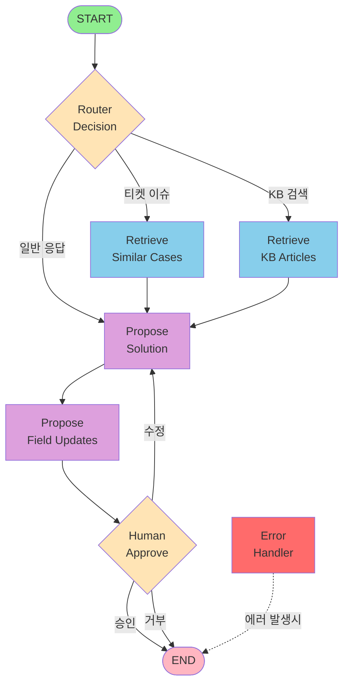

# LangGraph Workflow - AI Contact Center OS

## 워크플로우 다이어그램

## Day 9-11 완료 요약

### ✅ Day 9: LangGraph 상태 스키마
- `backend/models/graph_state.py` (280+ lines)
- TypedDict + Pydantic dual implementation
- Conversion functions: `pydantic_to_typed_dict()`, `typed_dict_to_pydantic()`
- Helper functions: `add_error()`, `has_errors()`, `get_latest_error()`

### ✅ Day 10: LangGraph 노드 구현
**4개 에이전트 파일**:
1. `backend/agents/retriever.py` - retrieve_cases(), retrieve_kb()
2. `backend/agents/resolver.py` - propose_solution(), propose_field_updates()
3. `backend/agents/router.py` - context_router()
4. `backend/agents/utils.py` - 공통 유틸리티

**단위 테스트 (23/23 통과)**:
- `tests/agents/test_retriever.py` (5 tests)
- `tests/agents/test_resolver.py` (4 tests)
- `tests/agents/test_router.py` (4 tests)
- `tests/agents/test_utils.py` (10 tests)

### ✅ Day 11: LangGraph 그래프 조립
**Orchestrator 구현**:
- `backend/agents/orchestrator.py` - LangGraph workflow graph
- 7개 노드 (router_decision, retrieve_cases, retrieve_kb, propose_solution, propose_field_updates, human_approve, error_handler)
- 조건부 엣지 (router_condition, approval_condition)
- Human-in-the-loop placeholder

**통합 테스트 (15/15 통과)**:
- `tests/test_orchestrator.py`
- Graph 구조 테스트
- 라우팅 조건 테스트
- 승인 플로우 테스트
- 에러 핸들링 테스트

**문서화**:
- `docs/langgraph-workflow.md` - Mermaid 다이어그램 + 상세 설명

## 총 테스트 결과

- **Day 10**: 23/23 agent tests passed ✅
- **Day 11**: 15/15 orchestrator tests passed ✅
- **Total**: 38/38 tests passed (100%) ✅
