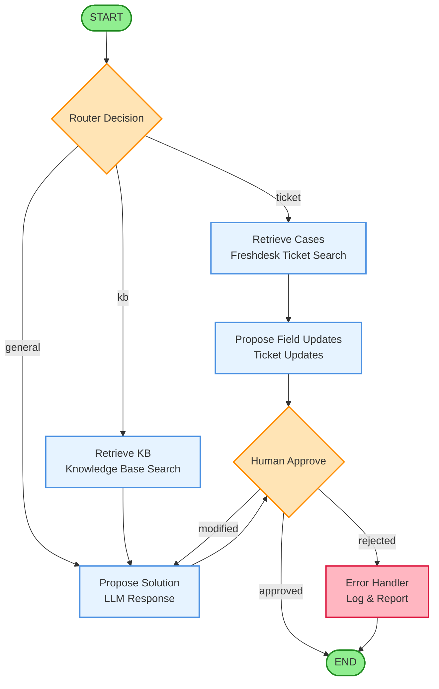

# LangGraph 워크플로우 문서

## 개요

이 문서는 AI Contact Center OS의 LangGraph 기반 워크플로우를 설명합니다. LangGraph는 상태 기반 멀티 에이전트 시스템을 구현하는 프레임워크로, Freshdesk 티켓 자동화 및 지식베이스 검색을 처리합니다.

## 워크플로우 다이어그램



## 노드 설명

### 1️⃣ Router Decision (라우터 결정)

**역할**: 입력된 요청의 유형을 분석하여 적절한 처리 경로로 라우팅합니다.

**입력**:
- `state.ticket_context`: 사용자 요청 또는 티켓 정보

**출력 (next_node)**:
- `"ticket"`: Freshdesk 티켓 관련 요청
- `"kb"`: 지식베이스 검색 요청
- `"general"`: 일반 LLM 응답 요청

**상태 변경**:
```python
state.router_decision = "ticket" | "kb" | "general"
```

---

### 2️⃣ Retrieve Cases (티켓 검색)

**역할**: Freshdesk API를 통해 관련 티켓을 검색합니다.

**입력**:
- `state.ticket_context`: 검색 키워드 또는 티켓 ID

**프로세스**:
1. Freshdesk API 호출 (`GET /api/v2/tickets`)
2. 유사한 티켓 필터링
3. 결과를 구조화된 형식으로 변환

**상태 변경**:
```python
state.search_results = {
    "tickets": [...],
    "count": N,
    "source": "freshdesk"
}
```

**다음 노드**: `propose_field_updates`

---

### 3️⃣ Retrieve KB (지식베이스 검색)

**역할**: 내부 지식베이스 또는 외부 문서에서 관련 정보를 검색합니다.

**입력**:
- `state.ticket_context`: 검색 쿼리

**프로세스**:
1. 벡터 검색 또는 키워드 검색
2. 관련성 높은 문서 추출
3. 컨텍스트 구성

**상태 변경**:
```python
state.search_results = {
    "documents": [...],
    "count": N,
    "source": "knowledge_base"
}
```

**다음 노드**: `propose_solution`

---

### 4️⃣ Propose Field Updates (티켓 필드 업데이트 제안)

**역할**: 검색된 티켓 정보를 바탕으로 Freshdesk 티켓 필드 업데이트를 제안합니다.

**입력**:
- `state.search_results`: 검색된 티켓 정보

**프로세스**:
1. LLM을 통해 티켓 분석
2. 적절한 필드 업데이트 생성 (status, priority, tags, custom_fields)
3. JSON 형식으로 제안 구성

**상태 변경**:
```python
state.proposed_action = {
    "action_type": "update_ticket",
    "updates": {
        "status": 2,
        "priority": 3,
        "tags": ["billing", "urgent"],
        "custom_fields": {...}
    },
    "reasoning": "설명..."
}
```

**다음 노드**: `human_approve`

---

### 5️⃣ Propose Solution (솔루션 제안)

**역할**: 지식베이스 검색 결과 또는 일반 쿼리에 대한 LLM 기반 솔루션을 생성합니다.

**입력**:
- `state.search_results`: 검색 결과 (있는 경우)
- `state.ticket_context`: 원본 요청

**프로세스**:
1. LLM에 컨텍스트 전달
2. 답변 생성
3. 관련 문서 링크 포함

**상태 변경**:
```python
state.proposed_action = {
    "action_type": "provide_solution",
    "solution": "답변 텍스트...",
    "references": ["doc1", "doc2"],
    "confidence": 0.95
}
```

**다음 노드**: `human_approve`

---

### 6️⃣ Human Approve (인간 승인)

**역할**: 제안된 액션을 인간 에이전트에게 승인 요청합니다.

**입력**:
- `state.proposed_action`: 제안된 액션

**프로세스** (인터랙티브):
1. 제안 내용 표시
2. 사용자 입력 대기: `approved`, `modified`, `rejected`
3. `modified`인 경우 수정 사항 입력 받기

**상태 변경**:
```python
state.approval_status = "approved" | "modified" | "rejected"
state.modification_notes = "..." (if modified)
```

**조건부 라우팅**:
- `approved` → `END` (워크플로우 완료)
- `modified` → `propose_solution` (재제안)
- `rejected` → `error_handler` (에러 처리)

---

### 7️⃣ Error Handler (에러 처리)

**역할**: 거부된 요청이나 실패한 작업을 로깅하고 보고합니다.

**입력**:
- `state.approval_status`: "rejected"
- `state.proposed_action`: 거부된 액션

**프로세스**:
1. 에러 로그 기록
2. 에러 메트릭 업데이트
3. (옵션) 알림 전송

**상태 변경**:
```python
state.error_log = {
    "timestamp": "...",
    "reason": "human_rejected",
    "details": {...}
}
```

**다음 노드**: `END`

---

## 플로우 경로 설명

### 📌 경로 1: Freshdesk 티켓 처리

```
START → router_decision → retrieve_cases → propose_field_updates → human_approve → END
```

**시나리오**: "티켓 #12345의 상태를 업데이트해줘"

1. **Router**: 티켓 관련 요청으로 분류 → `"ticket"`
2. **Retrieve Cases**: Freshdesk API에서 티켓 #12345 검색
3. **Propose Field Updates**: 티켓 분석 후 업데이트 제안 (예: status=4, priority=2)
4. **Human Approve**: 에이전트 승인 → Freshdesk API 업데이트 실행
5. **END**: 완료

---

### 📌 경로 2: 지식베이스 검색

```
START → router_decision → retrieve_kb → propose_solution → human_approve → END
```

**시나리오**: "비밀번호 재설정 방법이 뭐야?"

1. **Router**: 지식베이스 검색 요청으로 분류 → `"kb"`
2. **Retrieve KB**: 지식베이스에서 "비밀번호 재설정" 문서 검색
3. **Propose Solution**: 검색 결과 기반 답변 생성
4. **Human Approve**: 에이전트 확인 후 고객에게 전달
5. **END**: 완료

---

### 📌 경로 3: 일반 LLM 응답

```
START → router_decision → propose_solution → human_approve → END
```

**시나리오**: "회사 정책에 대해 설명해줘"

1. **Router**: 일반 질문으로 분류 → `"general"`
2. **Propose Solution**: LLM이 직접 답변 생성
3. **Human Approve**: 에이전트 승인
4. **END**: 완료

---

### 📌 경로 4: 수정 후 재제안 (Loopback)

```
... → human_approve (modified) → propose_solution → human_approve → END
```

**시나리오**: 에이전트가 제안 내용 수정 요청

1. **Human Approve**: 에이전트가 "답변이 너무 짧아, 더 자세히" 요청
2. **Propose Solution**: 수정 사항 반영하여 새 솔루션 생성
3. **Human Approve**: 재승인
4. **END**: 완료

---

### 📌 경로 5: 거부 및 에러 처리

```
... → human_approve (rejected) → error_handler → END
```

**시나리오**: 제안이 부적절하여 거부됨

1. **Human Approve**: 에이전트가 "이 답변은 부적절해" 거부
2. **Error Handler**: 거부 사유 로깅, 메트릭 업데이트
3. **END**: 워크플로우 종료

---

## 상태 전이 흐름

### State 구조

```python
class WorkflowState(TypedDict):
    ticket_context: str           # 입력 요청
    router_decision: str          # "ticket" | "kb" | "general"
    search_results: dict          # 검색 결과
    proposed_action: dict         # 제안된 액션
    approval_status: str          # "approved" | "modified" | "rejected"
    modification_notes: str       # 수정 사항 (optional)
    error_log: dict               # 에러 로그 (optional)
```

### 상태 변경 타임라인

```
[START]
state = {
    ticket_context: "티켓 #123 상태 변경",
    router_decision: None,
    search_results: None,
    proposed_action: None,
    approval_status: None
}

[After router_decision]
state.router_decision = "ticket"

[After retrieve_cases]
state.search_results = {
    "tickets": [...],
    "count": 5,
    "source": "freshdesk"
}

[After propose_field_updates]
state.proposed_action = {
    "action_type": "update_ticket",
    "updates": {"status": 4, "priority": 2}
}

[After human_approve]
state.approval_status = "approved"

[END]
```

---

## 승인 프로세스 세부사항

### Human Approve 노드 동작

```python
def human_approve_node(state: WorkflowState) -> WorkflowState:
    """
    인간 에이전트에게 승인 요청
    """
    # 1. 제안 내용 표시
    print(f"제안된 액션: {state['proposed_action']}")

    # 2. 사용자 입력 대기
    decision = input("승인하시겠습니까? (approved/modified/rejected): ")

    # 3. 상태 업데이트
    if decision == "modified":
        modification = input("수정 사항을 입력하세요: ")
        state["modification_notes"] = modification
        state["approval_status"] = "modified"
    else:
        state["approval_status"] = decision

    return state
```

### 조건부 라우팅 로직

```python
def route_approval(state: WorkflowState) -> str:
    """
    승인 상태에 따라 다음 노드 결정
    """
    status = state["approval_status"]

    if status == "approved":
        return END  # 워크플로우 종료
    elif status == "modified":
        return "propose_solution"  # 재제안
    elif status == "rejected":
        return "error_handler"  # 에러 처리
    else:
        raise ValueError(f"Unknown approval status: {status}")
```

---

## 실제 사용 예시

### 예시 1: 티켓 우선순위 자동 조정

**입력**:
```python
initial_state = {
    "ticket_context": "티켓 #456의 우선순위를 '긴급'으로 변경해줘"
}
```

**워크플로우 실행**:
```python
result = app.invoke(initial_state)
```

**결과**:
```python
{
    "ticket_context": "티켓 #456의 우선순위를 '긴급'으로 변경해줘",
    "router_decision": "ticket",
    "search_results": {
        "tickets": [{"id": 456, "subject": "...", "priority": 1}],
        "count": 1,
        "source": "freshdesk"
    },
    "proposed_action": {
        "action_type": "update_ticket",
        "updates": {"priority": 4},  # 긴급=4
        "reasoning": "사용자가 긴급 처리를 요청함"
    },
    "approval_status": "approved"
}
```

---

### 예시 2: 지식베이스 기반 답변

**입력**:
```python
initial_state = {
    "ticket_context": "계정 삭제 방법을 알려줘"
}
```

**워크플로우 실행**:
```python
result = app.invoke(initial_state)
```

**결과**:
```python
{
    "ticket_context": "계정 삭제 방법을 알려줘",
    "router_decision": "kb",
    "search_results": {
        "documents": [
            {"title": "계정 관리 가이드", "content": "...", "url": "..."}
        ],
        "count": 3,
        "source": "knowledge_base"
    },
    "proposed_action": {
        "action_type": "provide_solution",
        "solution": "계정 삭제는 다음 단계로 진행됩니다:\n1. 설정 메뉴 접속\n2. '계정 삭제' 버튼 클릭\n...",
        "references": ["https://kb.example.com/account-deletion"],
        "confidence": 0.92
    },
    "approval_status": "approved"
}
```

---

## 추가 정보

### LangGraph 구성 코드

워크플로우를 구성하는 실제 코드는 `test_langgraph.py`에 구현되어 있습니다:

```python
from langgraph.graph import StateGraph, END

# 그래프 생성
workflow = StateGraph(WorkflowState)

# 노드 추가
workflow.add_node("router_decision", router_decision_node)
workflow.add_node("retrieve_cases", retrieve_cases_node)
workflow.add_node("retrieve_kb", retrieve_kb_node)
workflow.add_node("propose_field_updates", propose_field_updates_node)
workflow.add_node("propose_solution", propose_solution_node)
workflow.add_node("human_approve", human_approve_node)
workflow.add_node("error_handler", error_handler_node)

# 엣지 추가
workflow.set_entry_point("router_decision")
workflow.add_conditional_edges("router_decision", route_query)
workflow.add_edge("retrieve_cases", "propose_field_updates")
workflow.add_edge("retrieve_kb", "propose_solution")
workflow.add_edge("propose_field_updates", "human_approve")
workflow.add_edge("propose_solution", "human_approve")
workflow.add_conditional_edges("human_approve", route_approval)
workflow.add_edge("error_handler", END)

# 컴파일
app = workflow.compile()
```

---

## 참고 자료

- [LangGraph 공식 문서](https://python.langchain.com/docs/langgraph)
- [Freshdesk API 문서](https://developers.freshdesk.com/api/)
- [프로젝트 GitHub](https://github.com/your-org/project-a-spinoff)

---

**문서 버전**: 1.0
**최종 업데이트**: 2025-11-01
**작성자**: AI Contact Center OS Team
